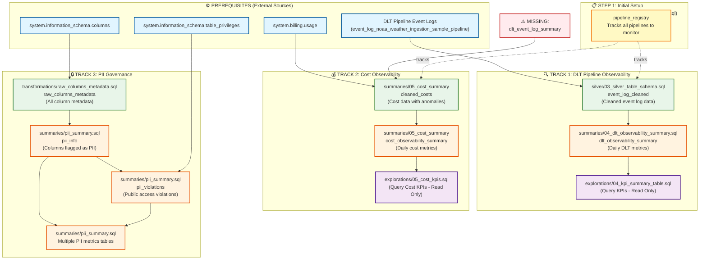

# Pipeline Observability - High Level Overview

This document explains the relationship between all the observability files and the order in which they should be executed.

## Architecture Overview

The pipeline observability framework is composed of three main tracks:

1. **DLT Pipeline Observability** - Monitors DLT pipeline health, performance, and failures
2. **Cost Observability** - Tracks and analyzes pipeline costs and resource usage
3. **PII Governance** - Identifies and monitors PII data across your catalog

## Execution Order



## Execution Steps

### Prerequisites
Before running any observability scripts, ensure you have:
1. **DLT Pipeline Running** - Your DLT pipeline must be configured to save event logs
2. **Access to System Tables** - `system.billing.usage` and `system.information_schema.*`

### Step-by-Step Execution Guide

#### 🟢 STEP 1: Create Pipeline Registry (One-time setup)
```sql
-- File: metadata/03_pipeline_registry_ddl.sql
-- Creates the registry table and registers your pipeline
-- Action: Run this once, then INSERT your pipeline details
```

#### 🟢 STEP 2A: DLT Observability Track (Run in order)

1. **Create Silver Layer - Event Log Cleaned**
   ```sql
   -- File: silver/03_silver_table_schema.sql
   -- Creates: event_log_cleaned
   -- Source: Your DLT pipeline event log table
   -- Note: Update the pipeline_name and source table to match YOUR pipeline
   ```

2. **Create Gold Layer - DLT Summary**
   ```sql
   -- File: summaries/04_dlt_observability_summary.sql
   -- Creates: dlt_observability_summary
   -- Source: event_log_cleaned
   -- Note: This assumes event_log_cleaned has specific columns (status, runtime_minutes, etc.)
   --       You may need to adapt the silver table schema to include these fields
   ```

3. **Query DLT KPIs** (Optional - for dashboards)
   ```sql
   -- File: explorations/04_kpi_summary_table.sql
   -- Read-only queries for visualization
   ```

#### 🟢 STEP 2B: Cost Observability Track (Run in order)

⚠️ **ISSUE IDENTIFIED**: The cost track references `leigh_robertson_demo.observability.dlt_event_log_summary` which doesn't exist yet. You'll need to either:
- Create this table from your DLT event logs, OR
- Modify `summaries/05_cost_summary` to join directly with `event_log_cleaned`

1. **Create Missing Table** (You need to create this)
   ```sql
   -- MISSING: Create dlt_event_log_summary table
   -- Should contain: pipeline_id, pipeline_name, job_id, output_table, 
   --                 cluster_type, idle_minutes, active_minutes
   ```

2. **Create Cost Tables**
   ```sql
   -- File: summaries/05_cost_summary
   -- Creates: cleaned_costs, cost_observability_summary
   -- Sources: system.billing.usage + dlt_event_log_summary
   ```

3. **Query Cost KPIs** (Optional - for dashboards)
   ```sql
   -- File: explorations/05_cost_kpis.sql
   -- Read-only queries for visualization
   ```

#### 🟢 STEP 2C: PII Governance Track (Run in order - OR use as DLT pipeline)

This track uses streaming tables, so it can be run as a DLT pipeline:

1. **Create Raw Metadata**
   ```sql
   -- File: transformations/raw_columns_metadata.sql
   -- Creates: raw_columns_metadata (streaming table)
   -- Source: system.information_schema.columns
   ```

2. **Create All PII Tables**
   ```sql
   -- File: summaries/pii_summary.sql
   -- Creates: pii_info, pii_violations, pii_by_schema, 
   --          pii_kpi_summary, pii_type_distribution, etc.
   -- Sources: raw_columns_metadata + system tables
   -- Note: These are streaming tables and should ideally run in a DLT pipeline
   ```

## Important Notes

### 🔴 Issues to Address

1. **Missing Table**: `dlt_event_log_summary` is referenced but not created
   - Used in: `summaries/05_cost_summary`
   - You need to create this table or modify the cost summary logic

2. **Hardcoded Pipeline Name**: The silver layer has a hardcoded pipeline name
   - File: `silver/03_silver_table_schema.sql`
   - Line: `'noaa_weather_ingestion_sample_pipeline' AS pipeline_name`
   - Action: Update to match your pipeline name

3. **Column Assumptions**: The DLT summary expects specific columns that may not exist
   - Expected columns in `event_log_cleaned`: status, runtime_minutes, retry_count_7d, source_type, target_table_name, is_streaming, event_time
   - You may need to enhance the silver layer transformation

### 🟡 Recommended Setup Order

**For your existing pipeline:**

1. ✅ Run `metadata/03_pipeline_registry_ddl.sql` and insert your pipeline details
2. ✅ Update and run `silver/03_silver_table_schema.sql` (modify for your pipeline)
3. ⚠️ Create the missing `dlt_event_log_summary` table or modify cost queries
4. ✅ Run `summaries/04_dlt_observability_summary.sql` (after fixing silver schema)
5. ✅ Run `summaries/05_cost_summary` (after fixing dependencies)
6. ✅ Run `transformations/raw_columns_metadata.sql` in a DLT pipeline
7. ✅ Run `summaries/pii_summary.sql` in the same DLT pipeline

### 💡 Best Practices

- **Schedule DLT observability summaries** to run daily
- **PII governance** should run as a continuous DLT pipeline
- **Cost summaries** should run daily after billing data is updated
- **Use the exploration queries** to build dashboards in Databricks SQL or Lakeview

## Data Flow Summary

| Track | Bronze (Source) | Silver (Cleaned) | Gold (Aggregated) | Reporting |
|-------|----------------|------------------|-------------------|-----------|
| **DLT Observability** | DLT Event Logs | event_log_cleaned | dlt_observability_summary | 04_kpi_summary_table.sql |
| **Cost** | system.billing.usage | cleaned_costs | cost_observability_summary | 05_cost_kpis.sql |
| **PII** | system.information_schema | raw_columns_metadata | pii_info, pii_violations, etc. | (Build your own) |

## Next Steps

1. Review the missing `dlt_event_log_summary` table requirement
2. Customize `silver/03_silver_table_schema.sql` for your pipeline's event log structure
3. Decide if you want to run PII governance as a separate DLT pipeline
4. Set up scheduling for daily summaries
5. Build dashboards using the exploration queries as a starting point

